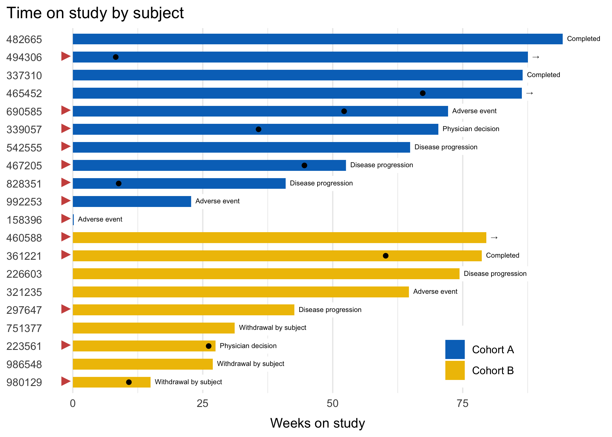

<!-- README.md is generated from README.Rmd. Please edit that file -->

# ggswimlane

**\* Still in development**

<!-- badges: start -->
<!-- badges: end -->

ggswimlane is a ggplot wrapper that simplifies the construction of
swimlane plots, which are a common tool for showing patient trajectories
through a clinical trial.

## Installation

You can install the released version of ggswimlane from
[GitHub](https://github.com/) with:

``` r
# install.packages("devtools")
devtools::install_github("tgerke/ggswimlane")
```

## Example

``` r
library(dplyr)
library(ggplot2)
library(ggswimlane)

patient_disposition %>%
  mutate(
    reason_off_study = tidyr::replace_na(reason_off_study, "&#8594;"),
    prior_drug = dplyr::case_when(
      prior_drug == "Yes"~ "&#9658;", 
      TRUE ~ NA_character_
    )
  ) %>%
  order_swimlane(subject, weeks_on_study, cohort) %>%
  ggplot() +
  geom_swimlane(subject, weeks_on_study, cohort) + 
  ggsci::scale_fill_jco() +
  geom_swimlane_text(subject, weeks_on_study, reason_off_study) + 
  geom_point(
    aes(x = subject, y = partial_response), 
    na.rm = TRUE
  ) + 
  geom_swimlane_rug(x = subject, label_var = prior_drug, color = "#CD534C") + 
  theme_swimlane(legend.position = c(.8, .1)) + 
  ggtitle("Time on study by subject") + 
  ylab("Weeks on study")
```


