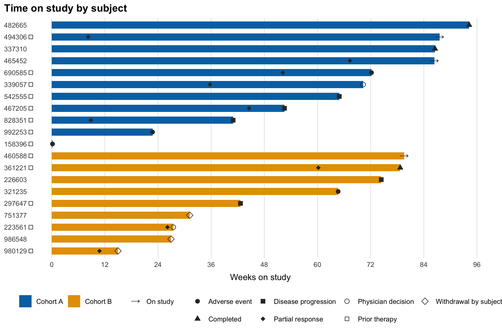

<!-- README.md is generated from README.Rmd. Please edit that file -->

# ggswimlane

<!-- badges: start -->

[](https://github.com/tgerke/ggswimlane/actions/workflows/R-CMD-check.yaml)
[](https://lifecycle.r-lib.org/articles/stages.html#experimental)
<!-- badges: end -->

ggswimlane is a ggplot2 extension for swimlane (swimmer) plots, a common
way to show patient trajectories through a clinical trial: one bar per
subject, with events, status, and baseline characteristics marked along
each lane. Legends come for free, and the default palette and theme are
ready for reports without further styling.

## Installation

You can install the development version of ggswimlane from
[GitHub](https://github.com/tgerke/ggswimlane) with:

``` r
# install.packages("pak")
pak::pak("tgerke/ggswimlane")
```

## Example

A complete swimlane from the bundled `patient_disposition` data. Each
`geom_swimlane_*()` layer takes bare column names, and every symbol is
added to the legend automatically:

``` r
library(dplyr)
library(ggplot2)
library(ggswimlane)

patient_disposition |>
  mutate(
    prior_drug = if_else(prior_drug == "Yes", "Prior therapy", NA)
  ) |>
  order_swimlane(subject, weeks_on_study, cohort) |>
  ggplot() +
  geom_swimlane(subject, weeks_on_study, cohort) +
  geom_swimlane_status(subject, weeks_on_study, reason_off_study) +
  geom_swimlane_marker(
    subject, partial_response,
    marker_label = "Partial response"
  ) +
  geom_swimlane_rug(subject, prior_drug) +
  scale_x_continuous(breaks = scales::breaks_width(12)) +
  labs(title = "Time on study by subject", x = "Weeks on study") +
  theme_swimlane()
```



The [gallery
vignette](https://tgerke.github.io/ggswimlane/articles/gallery.html)
walks through simpler starting points, stacked treatment phases, text
annotations, and customization.
